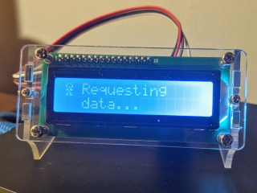
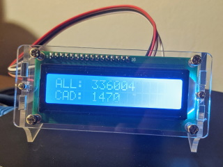

# CovidMonitor

A simple .NET Core worker service that fetches the latest confirmed COVID-19 cases from the John Hopkins dataset and displays them on an LCD screen powered by an Arduino Nano. It will update the data every hour.





## Running the Covid19DataProvider

The data provider runs on the desktop computer, fetches the latest COVID-19 data and sends it to the connected Arduino Nano over the serial port for display.

The data provider is hard coded to look for the Arduinon on `COM3`. Change `COM_PORT` in `Worker.cs` to your COM port. If anyone every uses this code, maybe I'll change it to a configuration option.

### Running from the command line


First we need to publish the application to a directory on our computer. I'm using `C:\temp\covid19`.

From the root of the solution;

```bat
dotnet publish -o c:\temp\covid19 .\Covid19DataProvider\
```

Then we can run the program from the command line.


```bat
C:\temp\covid19\Covid19DataProvider.exe
```